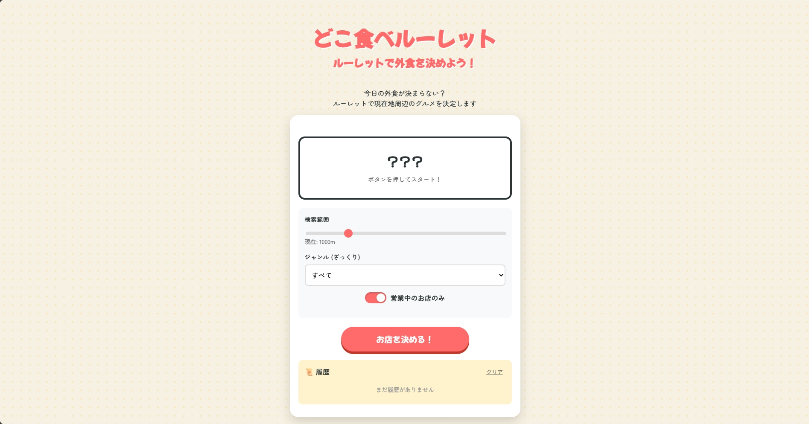

# どこ食べルーレット

現在地周辺の飲食店から、行き先をランダムに決めるWebアプリです。

「今日どこで食べる？」と迷ったときに、検索条件を選んでルーレットを回せます。

[Webアプリにアクセス](https://www.food-roulette.jp/)



## 使い方

1. 検索範囲やジャンルを設定します
2. 「お店を決める！」を押して位置情報の利用を許可します
3. ルーレットで選ばれたお店を確認します
4. 必要に応じてGoogleマップを開くか、結果をXで共有します

## 使用技術

- HTML / CSS / JavaScript
- Google Maps JavaScript API / Places API
- Geolocation API

## ローカルで動かす

Google CloudでMaps JavaScript APIとPlaces APIを有効にし、APIキーを用意してください。

```bash
git clone https://github.com/Ibkmakomanai/food-roulette.git
cd food-roulette
python -m http.server 8000
```

`index.html`に記載されているGoogle Maps APIキーを自分のキーに差し替え、`http://localhost:8000`を開きます。

APIキーには、利用するWebサイトとAPIを制限することをおすすめします。

## 注意点

- 利用には位置情報の許可が必要です
- 店舗情報や営業時間はGoogle Mapsの情報を使用しています。来店前に最新情報をご確認ください
